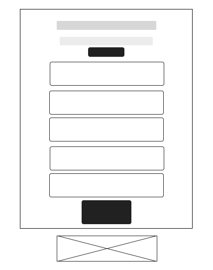

# Projeto de Interface

## User Flow

Fluxo de usuário (User Flow) é uma técnica que permite ao desenvolvedor mapear todo fluxo de navegação do usuário na aplicação. Essa técnica funciona para alinhar os caminhos e as possíveis ações que o usuário pode fazer junto com os membros de sua equipe.    (criar texto) 

<figure>
   <figcaption>Figura 4 -Demonstração do Fluxo do Usuário </figcaption>
</figure>

## Protótipo

### Protótipo de baixa fidelidade
 Com o propósito da criação do design de interface, foi projetado o wireframe de baixa fidelidade para auxiliar na diagramação da página, com  o intuito de esboçar dessa forma o produto final. 
 
 ### Home Page: 
  A Home Page, ou seja a página principal no qual guiará o usuário como sua porta de entrada e irá direcioná-lo a outros setores do website.
  Analisando-se os Requisitos Funcionais do Usuário conforme a etapa 1 do projeto, o Wire Frame foi criado com as seguintes  estruturas, na figura 5 observa-se o componente:

<em>•Usuários:</em>  possibilitará aos usuários fazer a escolha de entrar, seja Candidato ou Empresa e ao clicar serão direcionados ao fluxo da página web almejada;

<figure>
  
  <figcaption>Figura 5- Home Page e direcionamento de outros setores do web site. </figcaption>
</figure>

  

### Login
 A tela de Login permitirá que o usuário acesse ao Sistema, faça o seu cadastrado com as informações solicitadas, as credenciais que foram registradas auxiliará na identificação do usuário no Sistema.
 Conforme a Figura 6, os componentes são compostos por:

 <em>· Login:</em> será uma caixa de formulário com o elemento input que permitirá o usuário colocar seus dados como E-mail e Senha;

<em>·Entrar:</em>  após o usuário registrar seu email e senha, o botão Entrar permitirá que o usuário, faça o "click" e seja direcionado as outras interações do web site; 
 
 <em>·Criar Conta:</em> o botão Criar Conta após ser clicado, permitirá ao usuário registrar suas informações para efetivar o seu cadastro;

 <em>·Recuperar Senha:</em> caso o usuário esqueça de seu e-mail e senha registrados  através dessa interação irá recuperar a senha.
 
<figure> 
  
  <figcaption> Figura 6- Demonstração da Tela de Login.</figcaption>
</figure>

### Tela Principal
 A tela Principal guiará ao usuário, após ter sua conta cadastrada aos links que direcionará ao visitante para outras páginas do site. 

 · Conforme a  Figura 7, sera possível editar fotos de perfil, alterar nomes, botões de interações que direcionarão  especificamente ao fluxo de usuário pretendido.

 <em>·Botão de Menu</em>: ao clicar no botão Menu, o usuário será apresentado as funcionalidades específicas que o usuário deseja interagir no website.

<figure> 
  
  <figcaption> Figura 7- Demonstração da Tela Principal.</figcaption>
</figure>

### Tela de Cadastro

A tela de cadastro do usuário solicitará as informações que são necessárias para a criação de sua conta e senha, dessa forma, o visitante poderá ter acesso ao seu objetivo, que será o cadastro de seu portfólio profissional e candidatar nas vagas que interessarem.

 Conforme a Figura 08, a tela de Cadastro apresentará  formulários com as informaçōes pessoais do usuário como por exemplo: Nome, Idade, Cidade, Contato.
 A tela poderá ser acessada, após os usuários registrarem na tela de Login. 

<figure> 
  
  <figcaption> Figura 8- Demonstração da Tela de Cadastro.</figcaption>
</figure>

### Sobre Nós

A tela Sobre Nós permitirá ao usuário compreender por qual motivo o website foi criado e conhecer sobre a equipe que esta construindo o website. 

  Na figura 09 terá os componentes:

  <em>·Botão de Menu:</em> ao clicar no botão Menu, o usuário será apresentado as funcionalidades específicas que o usuário deseja interagir no website.

  <em>Rodapé:</em> informações da equipe desenvolveu o website e logo.

<figure> 
  
  <figcaption> Figura 9- Demonstração da Tela Sobre Nós.</figcaption>
</figure>

### Feedback do Usuário
 O feedback do usuário permitirá a equipe do projeto compreender sobre  o que ocorreu em sua interação do usuário, as dificuldades, analisar se o objetivo do produto criado foi alcançado e as experiências positivas do visitante. 
 Dessa forma poderá aprimorar a experiência.
   
   Na figura 10 apresenta-se o componenete:

  <em>·Area de texto para edição do feedback:</em>: área de texto para edição do feedback do usuário, permitindo que os usuários faça as funções CRUD (Create, Remove, Update and Delete).

 <em>·Botão de Menu:</em> ao clicar no botão Menu, o usuário será apresentado as funcionalidades específicas que o usuário deseja interagir no website.<figure>
 
 <figure> 
  
   <figcaption> Figura 10- Demonstração Feeback do Usuário.</figcaption>
</figure>

### Informações Profissionais
 Ao ser direcionado para a página Informações Profissionais o usuário poderá criar o seu portfólio profissional personalizado com fotos e texto explicando sobre sua vida profissional, acadêmica e qual cargo almeja. 

· Será apresentado nas Informações Profissionais, conforme a a figura 11, caixas de formulários com o elemento <input> que permitirá o usuário colocar seus dados profissionais como por exemplo Profissão, Carreira Acadêmica, Pretensão Salarial.

·<em>Botão Salvar</em> : consistirá em um botão que permitirá ao usuário Salvar suas informações profissionais, portofólio após registrar todas suas informações;

 <figure> 
  
   <figcaption> Figura 11- Demonstração Informações Profissionais.</figcaption>
</figure>

 ### Cadastro Redes Sociais 
  Permitirá ao usuário cadastrar suas redes sociais, profissionais ou pessoais, para que o recrutador tenha oportunidade de conhecer mais sobre sua personalidade.
  Conforme a figura 12, o usuário colocará o link de suas redes sociais na caixa formulário e posteriormente clicará em Salvar.

  <em>·Botão de Menu:</em> ao clicar no botão Menu, o usuário será apresentado as funcionalidades específicas que o usuário deseja interagir no website.  

 <figure> 
  
   <figcaption> Figura 12- Demonstração Cadastro Rede Sociais.</figcaption>
</figure>
  
  ### Resultado das Empresas
 Na tela Resultado das Empresas, permitirá que o usuário receba o resultado da sua aprovação ou desclassificação com as empresas contratantes no qual terá a imagem da Empresa Recrutadora e a mensagem de status da condição da candidatura do usuário na vaga ofertada.

  
 <figure> 
  
   <figcaption> Figura 13- Resultado das Empresas.</figcaption>
</figure>

